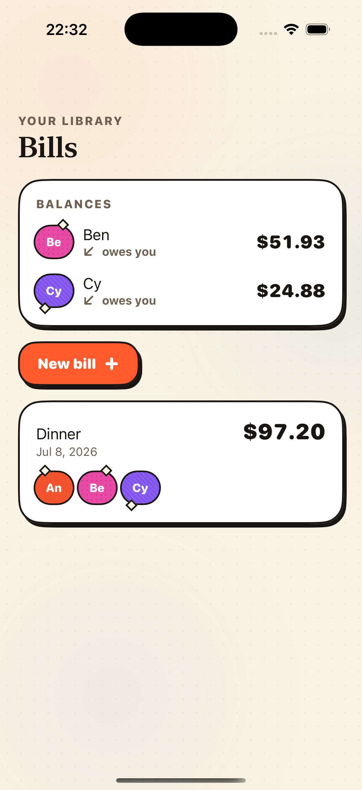
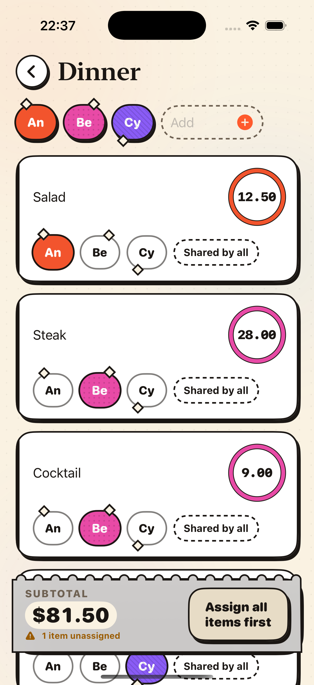
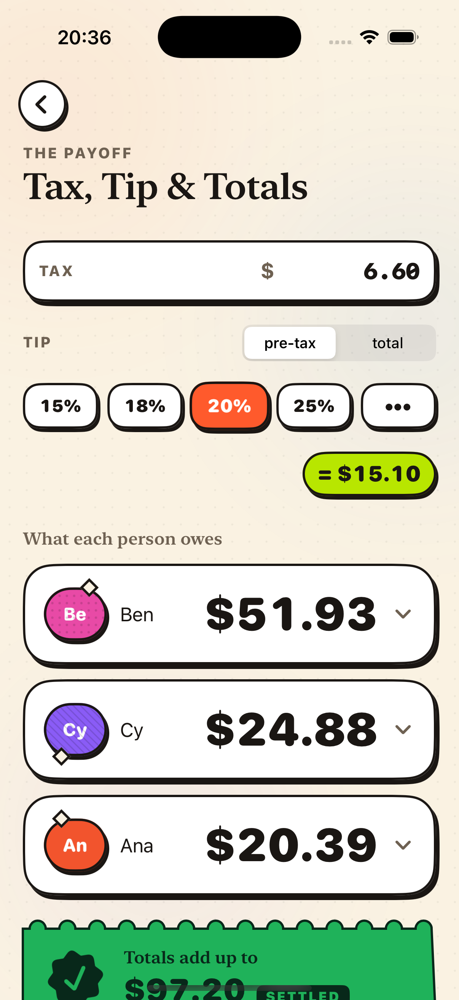

# SplitFair

**A native iOS bill splitter that splits by _who ordered what_ — not by headcount.** Fully offline, no account, no ads, and per-person totals that reconcile to the exact cent. Built in SwiftUI with a bold "Warm Receipt Brutalism" look.

[](https://github.com/zakariaf/SplitFair/actions/workflows/ci.yml)
[](LICENSE)
[](#requirements)
[](#)

> 🎥 **This repository is the result of a YouTube build.** It's a companion to a video on building a real mobile app end-to-end — kept public so you can read every commit, epic, and skill that shaped it. _(Video link: add it here.)_

<p align="center">
  
  
  
</p>

## What it does

Dinner with friends, a grocery run, a trip — enter the items, tap who ordered each (2+ people = split evenly), add tax and tip, and SplitFair tells everyone exactly what they owe. It remembers past bills locally and tracks the running **who-owes-whom** balance between you and your friends — all on device.

- **Split by order, not by headcount** — assign each item to the people who had it.
- **Exact-cent reconciliation** — per-person totals always sum to the grand total, to the cent, for any bill.
- **A local library of bills** + running balances ("Ben owes you $51.93") — no account, nothing synced.
- **Offline & private** — no network calls, no analytics, no SDKs. The App Store label reads _Data Not Collected_.

## The four non-negotiables

These are the spine of the project; every change respects them:

1. **Exact-cent reconciliation.** All money is integer minor units (cents) routed through one `allocate()` largest-remainder primitive. A `Double`/`Float` never touches money. The canonical **$97.20** acceptance bill must always stay green.
2. **Offline & private.** No network, no analytics, no accounts, no sync. Bills persist locally, and nothing ever leaves the device.
3. **Right-sized, not enterprise.** Three screens, one `@Observable` store. No ViewModels, no SwiftData, no TCA/VIPER/Coordinators.
4. **Bold but legible.** A number never sits on a gradient, chip, or glass — money is always ink-on-paper.

## How it's built

- **UI:** 100% SwiftUI, Model-View with `@Observable` (no ViewModels). Three screens: **Bills** (library + balances) → **The Bill** (assign) → **Tax, Tip & Totals**.
- **Money engine:** a local, Foundation-only Swift package, [`BillCore`](Packages/BillCore), that is pure and fully unit-tested — a compile firewall that keeps `Double` away from money.
- **Persistence:** one JSON file per bill plus a friends roster, in Application Support (atomic writes, default file protection). No SwiftData, no sync.
- **Zero third-party dependencies.**

### Built with a skills + epics workflow

This app was built with [Claude Code](https://claude.com/claude-code) following a deliberate, documented method you can read in the repo:

- [`epics/`](epics) — the ordered build plan. Each epic is one file: what it's for, the before/after state, and a task list. Start at [`epics/README.md`](epics/README.md).
- [`.claude/skills/`](.claude/skills) — a library of focused "how-to" skills (money math, design system, each component) loaded on demand while building.
- [`CLAUDE.md`](CLAUDE.md) — the non-negotiable contract every task obeys.

If you're here from the video, those three folders _are_ the methodology.

## Requirements

- **Xcode 16** or newer (iOS 18 SDK)
- **iOS 17+** deployment target
- macOS to build; the money-math tests run with just the Swift toolchain

## Getting started

```bash
git clone git@github.com:zakariaf/SplitFair.git
cd SplitFair

# Run the money-math suite (fast, no simulator — the $97.20 gate lives here)
swift test --package-path Packages/BillCore

# Open and run the app
open SplitFair.xcodeproj   # ⌘R on an iPhone simulator
```

## Project structure

```
SplitFair/
├─ SplitFair/               # the SwiftUI app
│  ├─ App/                  # @main app + the one BillStore (@Observable)
│  ├─ Features/             # Bills · Bill · Totals screens
│  ├─ DesignSystem/         # tokens, components, HARD COPY styling
│  └─ Persistence/          # local library store
├─ Packages/BillCore/       # pure, tested money engine (Foundation only)
├─ SplitFairTests/          # app unit tests
├─ SplitFairUITests/        # accessibility-audit UI smokes
├─ epics/                   # the ordered build plan
├─ .claude/skills/          # the build "how-to" skills
└─ CLAUDE.md                # the project contract
```

## Testing

- **`swift test --package-path Packages/BillCore`** — allocate invariants (fuzzed), the running-balances engine, and the **$97.20** reconciliation gate.
- **App unit + UI tests** run via `xcodebuild test` (the UI target carries `performAccessibilityAudit`).
- CI runs the money-math suite and `swiftlint --strict` / `swiftformat --lint` on every push and pull request.

## Contributing

Contributions are welcome — please read [CONTRIBUTING.md](CONTRIBUTING.md) first. The short version: keep the four non-negotiables intact (especially the $97.20 gate), open a pull request against `main`, and make sure CI is green.

## License

[MIT](LICENSE) © Zakaria Fatahi
